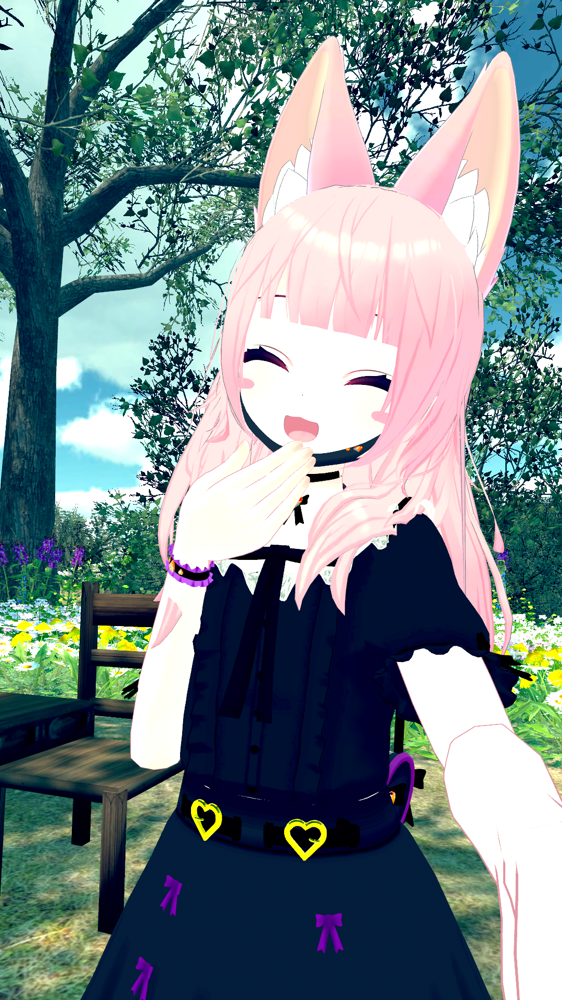

# Hello! 😊

I like documenting things I find interesting. This is not my portfolio.

||I’m Amy (Mobiuslau), a theoretical physics master student who loves to compose music, play drums, graphic design, and play games like Sound Voltex, Beatmania IIDX, BMS and Tera. Perhaps you’ll find something interesting here. Feel free to contact me too.   &nbsp; &nbsp; &nbsp; 🡪 [Amy's Nerdy Corner](https://mobiuslau.github.io/)  &nbsp; &nbsp; &nbsp; 🡪 [Youtube](https://www.youtube.com/user/mobiuslau)  &nbsp; &nbsp; &nbsp; 🡪 [Twitch](https://www.twitch.tv/mobiuslau)  &nbsp; &nbsp; &nbsp; 🡪 [Bokutachi](https://bokutachi.xyz/dashboard/users/Mobiuslau/)|

<button onclick="buttonFunc()">Music of the month.</button>

    <iframe width="448" height="252" src="https://www.youtube-nocookie.com/embed/_d8I48rqRTA" title="YouTube video player" frameborder="0" allow="accelerometer; clipboard-write; encrypted-media; gyroscope; picture-in-picture" allowfullscreen></iframe>

<!-- Button help from https://stackoverflow.com/questions/45136270/opening-a-div-a-box-with-a-list-of-links-after-click-of-button -->
