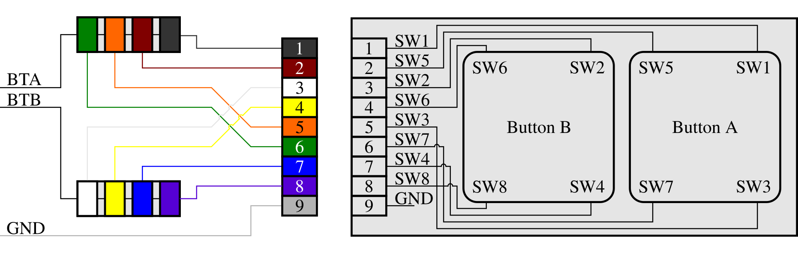

# Jubeat Controller

## Buttons & Wiring

On cabs, each button corner switch (SW#) receives its own I/O. The required amount of I/O pins would thus be 64. For an ASC, this is unnecessary. Popular microcontrollers such as the Pro Micro ATmega32U4 don't offer 64 I/O pins either way. Therefore, each SW corresponding to one button will be wired in parallel. This is possible since each switch is NO. Then, only 16 I/O pins are required. 

Internal P-UR's on the Pro Micro ATmega32U4 will be used. Therefore, it is not required to wire the buttons to a VCC with a P-UR.  

Wires used are [JST PH-9P cables with open ends](https://www.vanallesenmeer.nl/PH2.0-JST-9pin-kabel-30cm). The above diagram takes the colour scheme of these cables into account.