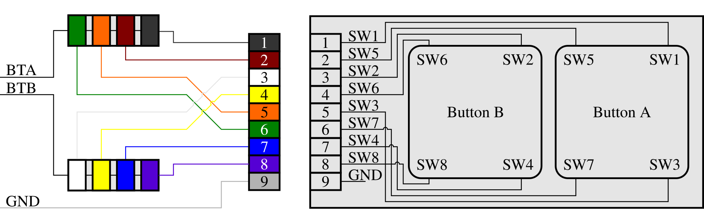
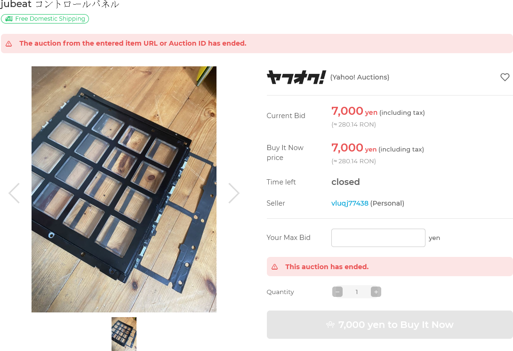
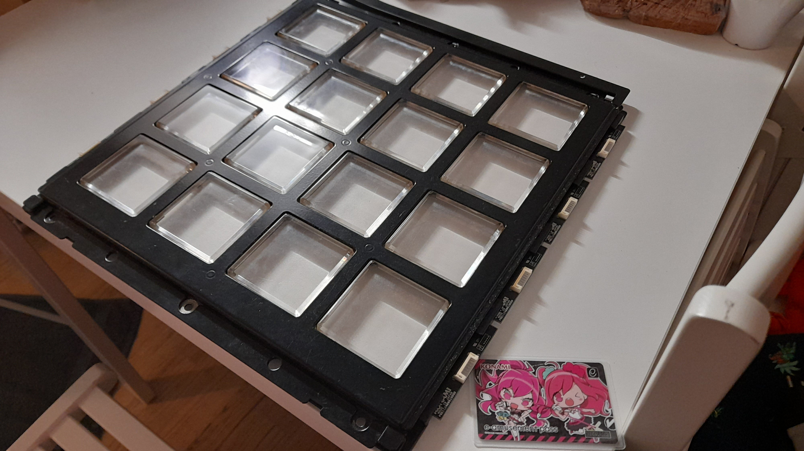
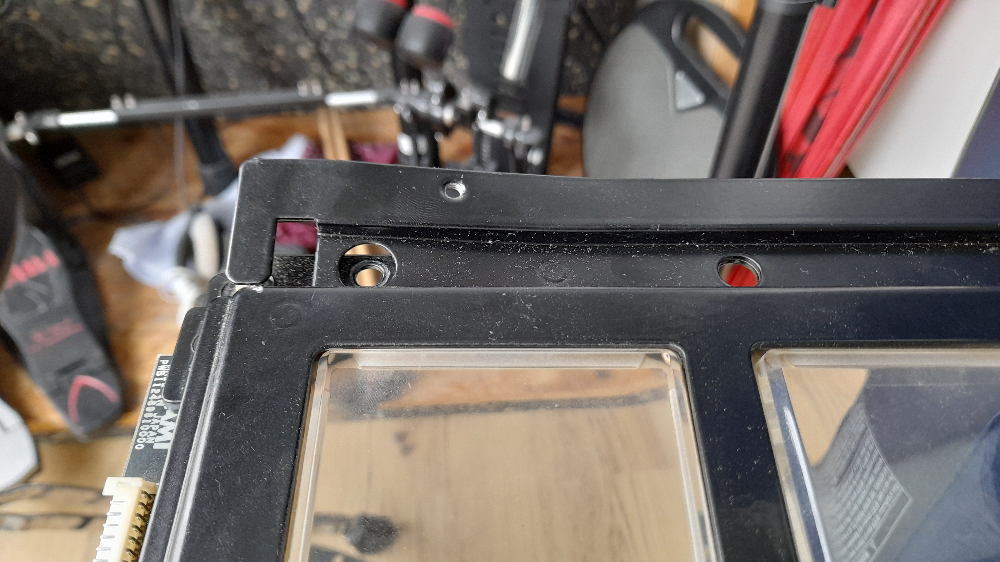
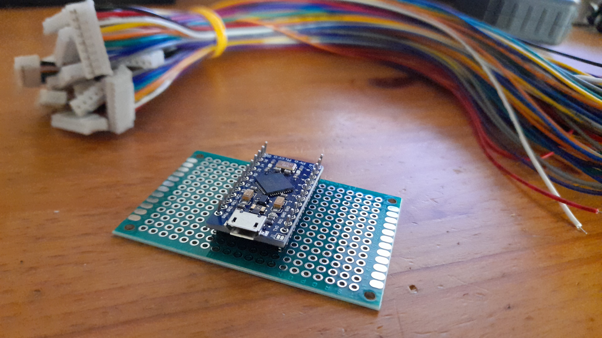

# Jubeat Controller

This article outlines information about Jubeat arcade style controllers, as well as the process of building one. This was published and documented in the hopes of it being used as future reference, since there isn't much documentation about this publically available in English. 

The controller as built in this article is currently W.I.P, along with this webpage. 

<br>


### Table of Contents

> [Jubeat Controller](#jubeat-controller)<br>
> &nbsp; &nbsp; [Table of Contents](#table-of-contents)<br>
> &nbsp; &nbsp; [Glossary](#glossary)<br>
> [Arcade Cabinet](#arcade-cabinet)<br>
> [Arcade Style Controller](#diy-arcade-style-controller)<br>
> &nbsp; &nbsp; [Panel](#panel)<br>
> &nbsp; &nbsp; [Buttons & Wiring](#buttons--wiring)<br>
> &nbsp; &nbsp; [Input/Output](#inputoutput)<br>
> &nbsp; &nbsp; [Monitor](#monitor)<br>
> &nbsp; &nbsp; [Parts](#parts)<br>
> &nbsp; &nbsp; [Files](#files)<br>
> [Build Process](#build-process)<br>
> &nbsp; &nbsp; [Expenses](#expenses)<br>

<br>

### Glossary

|Term|Abbreviation|Meaning|
|:-|:-|:-|
|Arcade Style Controller|ASC|Speaks for itself.|
|Arcade Cabinet|Cab|Machine from which a game can be played.|
|Ground|GND|Reference point from which voltages are measured [[1]](https://en.wikipedia.org/wiki/Ground_(electricity)).|
|Input/Output|I/O|Speaks for itself.|
|Normally Open|NO|Circuit isn't closed; no current.|
|Printed Circuit Board|PCB|Board which contains wiring scheme [[2]](https://en.wikipedia.org/wiki/Printed_circuit_board).|
|Pull-up Resistor|P-UR|Resistor used to ensure known off state for signal [[3]](https://en.wikipedia.org/wiki/Pull-up_resistor).|
|Voltage Common Collector|VCC|Higher voltage with respect to ground [[4]](https://en.wikipedia.org/wiki/Common_collector).|

**Table 1:** Glossary used in this article.

<br>

## Arcade Cabinet

W.I.P. 

<br>

## Arcade Style Controller

### Panel

W.I.P.

<br>

### Buttons & Wiring



**Figure 1:** Circuit diagram for the button PCB's. The wiring is such that each button is wired in parallel. The colours correspond to the colours from the cables used in the build as outlined in this article.

<br>

Arcade style button PCB's can be used in ASC builds. In this project, the PSB's came with the original panel. Otherwise, similar button PCB's can be acquired from Yubiparts [[5]](https://yubiparts.com/products/jubeat-button-sensor-pcb-board-frame?variant=40168391147707). 

Each button PCB accounts for 2 buttons, oriented in a horizontal manner. The PCB is constructed such that a rubberdome switch is placed on each corner of a button section (See figure 1). The acryllic buttons extend out on each corner, resting on these rubbers. This way, the view is not obstructed by switches. In this project, the rubbers came with the original panel. Otherwise, similar rubbers can be acquired from Yubiparts [[6]](https://yubiparts.com/products/jubeat-rubbers?variant=40168392753339).

Each switch is given the code `SW#`, where `#` is an integer between 1 and 8. The odd numbered switches account for the outermost button, while the even numbered switches account for the innermost button. The PCB is constructed in such a way that the pins `1, 2, 5, 6`, and `3, 4, 7, 8` account for the outermost -, and innermost buttons respectively. Pin `9` is the GDN pin (See figure 1). 

In cabs, each `SW#` receives its own I/O pin. The required amount of I/O pins would thus be 64. For an ASC, this is unnecessary. Popular micro controllers such as the Pro Micro ATmega32U4 don't offer 64 I/O pins anyway. Therefore, each `SW#` corresponding to a single button will be wired in parallel. This is sufficient since each switch is NO. Then, only 16 I/O pins are required. 

Internal P-UR's on the Pro Micro ATmega32U4 will be used. Therefore, it is not required to wire the buttons to a VCC with a P-UR.  

Wires used are [`JST PH-9P` cables with open ends](https://www.vanallesenmeer.nl/PH2.0-JST-9pin-kabel-30cm). Figure 1 takes the colour scheme of these cables into account.

<br>

### Input/Output


**Figure 2:** Pinout diagram for the Arduino Pro Micro ATmega32U4 micro controller. Figure from Golem [[7]](https://golem.hu/article/pro-micro-pinout/).

<br>

There are two repo's with useful I/O code for the ATmega32U4:

* [I/O code by CrazyRedMachine,](https://github.com/CrazyRedMachine/jubeatIO/tree/master/jubeatIO)
* [I/O code by Moldypie.](https://github.com/Moldypie/Jubeat_IO/blob/master/jubeat_IO.ino)

These I/O implementations assume that the switches for a single button are routed in parallel, and that the board has pullup resistors built in. 

The pinouts can be altered for the Pro Micro. The following list was used for this project;

```{2,3,4,5,6,7,8,9,10,14,15,16,A0,A1,A2,A3}```. 

This was chosen such that only the bottom I/O pins on the micro controller were used (see figure 2). This is for convenience. 

<br>

### Monitor

Arcade size monitors are absurdly difficult to obtain. Therefore, a 27" monitor was considered. The specific model used for this build is the [BenQ GL2780](https://tweakers.net/pricewatch/1405392/benq-gl2780-9h-punt-lj6lb-punt-qbe-zwart/specificaties/). A 27" monitor seemed sufficient, as letterboxing can be used to finetune the resolution to correspond to the physical panel size.

|Monitor|BenQ GL2780|
|:-|:-|
|Manufacturer code|9H.LJ6LB.QBE|
|Diagonal|27"|
|Panel|LCD TN|
|Resolution|(1920 x 1080) px [16/9]|
|Refresh rate|75 hz|
|Connectors|DP 1.2, DVI-D, HDMI 1.4, VGA (D-Sub)|
|DPI|82|
|Response|1 ms|
|Viewing angle|170°|
|Mounting|Vesa 100 mm|
|||
|Height|382 mm|
|Width|639.4 mm|
|Depth|52 mm|
|||
|Screen height||
|Screen width||

**Table 2:** Monitor information for BenQ GL2780. Data from Tweakers [[6]](https://tweakers.net/pricewatch/1405392/benq-gl2780-9h-punt-lj6lb-punt-qbe-zwart/specificaties/).

<br>

### Parts

Here is a list of parts which can be used for Jubeat ASC projects. Links to hardware are to Dutch webshops, but these parts should be obtainable elsewhere.

Currently there is no place which offers new acryllic buttons. Perhaps they can be obtained second hand, or along with an original panel.

|Category|Part|#|
|:-|:-|:-:|
|Buttons|[PCB's](https://yubiparts.com/products/jubeat-button-sensor-pcb-board-frame?variant=40168391147707)|8|
||[Corner rubbers](https://yubiparts.com/products/jubeat-rubbers?variant=40168392753339)|64|
||||
|Screws & Nuts|[M3x8L Pan Screw](https://tinyurl.com/24es6s7n)|36|
||[M3 Spring washer](https://www.rvspaleis.nl/ringen/veerring/din-127b/din-127b-a2/din-127b-[-]-a2-[-]-m3)|36|
||[M3 Flat washer](https://www.rvspaleis.nl/ringen/sluitring/din-125a/din-125a-[-]-a2/din-125a-[-]-a2-[-]-m3)|36|
||[M4x12L Pan Screw](https://tinyurl.com/24es6s7n)|6|
||[M4 Spring washer](https://www.rvspaleis.nl/ringen/veerring/din-127b/din-127b-a2/din-127b-[-]-a2-[-]-m4)|6|
||[M4 Flat washer](https://www.rvspaleis.nl/ringen/sluitring/din-125a/din-125a-[-]-a2/din-125a-[-]-a2-[-]-m4)|6|
||[M4 Nut](https://tinyurl.com/nkdnuz4h)|17|
||||
|Cables|[JST PH-9P open ends](https://www.vanallesenmeer.nl/PH2.0-JST-9pin-kabel-30cm)|8|
||||
|Micro Controller Options|[Arduino Pro Micro ATmega32U4](https://www.vanallesenmeer.nl/Arduino-Pro-Micro-ATmega32U4-5V-16MHz-compatibel)|1|
||[Arduino Leonardo](https://www.vanallesenmeer.nl/ARDUINO-LEONARDO-CLONE-met-kabel)|1|
||||
|Monitor Options 27"|[BenQ GL2780](https://www.coolblue.nl/product/863481/benq-gl2780.html?clickref=1101livFpIZn&utm_source=performancehorizon&utm_medium=affiliate&utm_campaign=Price+comparison&utm_content=1101livFpIZn&utm_term=1101lf89g&ref=293530&PHGref=1101livFpIZn&cmt=c_ph%2Capm_Price+comparison_%2Cacid1101l93%2Cacr_1101lf89g%2Caclr_1101livFpIZn)|1|

**Table 3:** Parts list for Jubeat ASC projects. 

<br>

### Files

Here is a list of files which can be used for Jubeat ASC projects.

|Category|Part|
|:-|:-|
|Arduino Code|[I/O by CrazyRedMachine](https://github.com/CrazyRedMachine/)|
||[I/O by Moldypie](https://github.com/Moldypie/Jubeat_IO/blob/master/jubeat_IO.ino)|
|||
|Gerber files|[Button PCB by Veroxzik](https://github.com/veroxzik/jubeat-boards)|

**Table 4:** File list for Jubeat ASC projects. 

<br>


## Build Process

W.I.P. 



**Figure 3:** The panel listing on Yahoo Auctions.

<br>

A listing for a Jubeat cabinet panel appeared on Yahoo Auctions on the 3rd of October, 2021 at 11:40 (Japan Time). This panel was bought out of impulse for ¥7,000 at 09:54 (Japan Time) a day later. The listing mentioned that the panel was damaged. However, according to the one image from the listing, the damage did not seem concerning to the panel mechanisms and electronics.

<br>




**Figure 4:** The panel as it arrived. It can be seen that the top part of the panel, it's mounting mechanism to the top, was bent.

<br>

The panel arrived on the 14th of October at the DHL warehouse, after which it was picked up a day later. The panel contains all the important electronics and buttons. It even came with the film layed between the panel and the protective acryllic plate in cabinets. The panel was indeed damaged, but also dirty. The only damage seemed to be the top bar being bent (see figure 4). This was not concerning at all since this part can be removed from the panel. This would make designing the ASC easier as well.

<br>



**Figure 5:** The electronics as they arrived. Shown are the Pro Micro ATmega32U4 resting on a prototyping board, and JST PH-9P cables. 

<br>

The essential electronics were ordered on the 16th of October from Vanallesenmeer, and arrived on the 20th. The next step was to solder the correct groups of wires on the PH-9P cables in parallel, which is currently the state of the build. 

<br>

### Expenses 

This may vary per project. However, it may be useful to indicate the total cost of similar projects. 

Table 5 is still being updated, since the project is not finished yet. 

|Store|Part|#|€ Total|
|:-|:-|:-:|-:|
|From Japan|Panel|1|56.22|
||Shipping||73.31|
||Import Tax||36.90|
|||||
|Coolblue|BenQ GL2780|1|149.00|
||Insurance policy||29.90|
||Shipping||0.99|
|||||
|Vanallesenmeer|Arduino Pro Micro ATmega32U4 5V 16MHz|1|9.35|
||JST PH 9p Cable|16|12.00|
||Prototyping Board 2x8cm (6x28Hole) PCB Double|10|3.20|
||Prototyping Board 4x6cm (14x20Hole) PCB Double|2|1.10|
|||||
|Bauhaus|Microfibre Cloth|5|4.30|
||Ring Ratchet Wrench 7mm|1|12.35|
||Screwdriver PH2|1|8.70|
||Screwdrivers SL PH|1|14.50|
|||||
|||||
|||Total|411.82|

**Table 5:** Expenses from the project as outlined in this article.