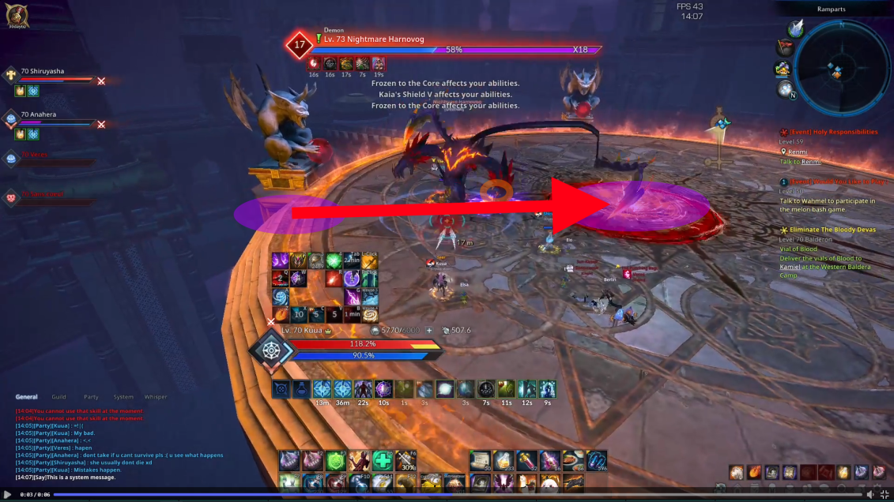
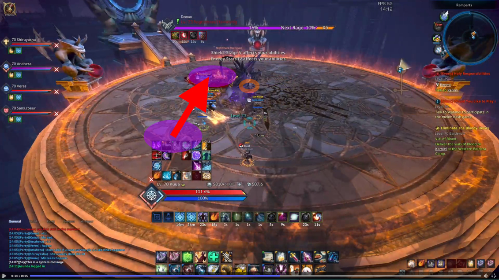

# {{ page.title }}
{:.no_toc}

I wouldn't exactly call it a good guide but more like a footage archive of their attacks with some tips. Please let me know if something should be corrected or improved.



## Table of Contents
{:.no_toc}

> - this unordered seed list will be replaced by toc as unordered list
> {:toc}

## First & Second Boss

See [Tenacity](https://tenacity-tera.eu/en/dungeons/dark-reach-citadel/). Note that for the second boss the video footage of the red and blue special attacks are incorrect: it shows the footage for the green special attack.

## Last Boss

### Normals

#### Swipe Swipe Front

<video src="lb/ssf.mp4" controls="controls" style="max-width: 700px;"></video>

#### Swipe Swipe Back

<video src="lb/ssb.mp4" controls="controls" style="max-width: 700px;"></video>

#### Front Hold

<video src="lb/f.mp4" controls="controls" style="max-width: 700px;"></video>

#### Swipe Swipe Swipe Back

<video src="lb/sssb.mp4" controls="controls" style="max-width: 700px;"></video>

#### Front Back

<video src="lb/fb.mp4" controls="controls" style="max-width: 700px;"></video>

#### Cross Hits & Swipes

Looks over either shoulder, take note. 2 variants with boss looking to $$x$$ starting side:

- *Hits*; makes cross with hits starting from $$x$$ back.
- *Swipes*; hits $$x$$ back $$\rightarrow$$ $$x$$ front. holds front $$\rightarrow$$ swipes cw/ccw, then ccw/cw from $$x$$ side.

Always take note of where he looks: He will attack there.

##### Hits

*Left*

<video src="lb/crosshl.mp4" controls="controls" style="max-width: 700px;"></video>

*Right*

<video src="lb/crosshr.mp4" controls="controls" style="max-width: 700px;"></video>

*Hit makes cross:*

 

##### Swipes

*Left*

<video src="lb/crosssl.mp4" controls="controls" style="max-width: 700px;"></video>

*Right*

<video src="lb/crosssr.mp4" controls="controls" style="max-width: 700px;"></video>

*Swipe stays on 1 side:*

 

#### Hit Jump

Note Their movement right before he hits: that's the timing.

<video src="lb/jump.mp4" controls="controls" style="max-width: 700px;"></video>

### Specials

#### Second Aggro Pull

<video src="lb/sap.mp4" controls="controls" style="max-width: 700px;"></video>

#### Second Aggro Swipe

<video src="lb/sas.mp4" controls="controls" style="max-width: 700px;"></video>

#### Res Attack

<video src="lb/res.mp4" controls="controls" style="max-width: 700px;"></video>

#### S-Swipes

Take note of Their stance: Their first swipe will either be clockwise or counter clockwise. If you have trouble avoiding getting hit or getting out in time use the safe regions on the first swipe for some extra time to get out.

##### Counter Clockwise Start

<video src="lb/ssccws.mp4" controls="controls" style="max-width: 700px;"></video>

##### Clockwise Start

<video src="lb/sscws.mp4" controls="controls" style="max-width: 700px;"></video>

### Mechs

#### Demonising

Debuff mech. Received in purple circle. Stuff hurts more. Core:

- At all times someone has to take it. Otherwise "cowards" and gives "win" hit (see later).
- 2 stacks = death.

Strategy: assign nums 1 & 2 beforehand: those players cycle debuff ($$n$$ mod $$2$$).

<video src="lb/demonising.mp4" controls="controls" style="max-width: 700px;"></video>

##### Win

<video src="lb/win.mp4" controls="controls" style="max-width: 700px;"></video>

Debuff player dies $$\Rightarrow$$ "I win": does flat dmg to party. Don't let this happen.

#### Tremble

Events:

- Stun AoE.
- Red circle which hits.

Someone in red circle $$\Rightarrow$$ gives boss stacks:

- Little $$\#$$ of stacks: He gets stunned.
- Moderate $$\#$$ of stacks: Weak dmg.
- Many $$\#$$ of stacks: Likely wipe.

<video src="lb/tremble.mp4" controls="controls" style="max-width: 700px;"></video>

Strategy: Just get away when you see tremble or iframe right before them hitting the ground. If someone got fucked they should be pulled out to avoid wipe.

### Notes

- Hitting ring of fire causes bleeding.
- If most of the party is dead the boss can be kited without them doing much attacking to gain time to resurrect.