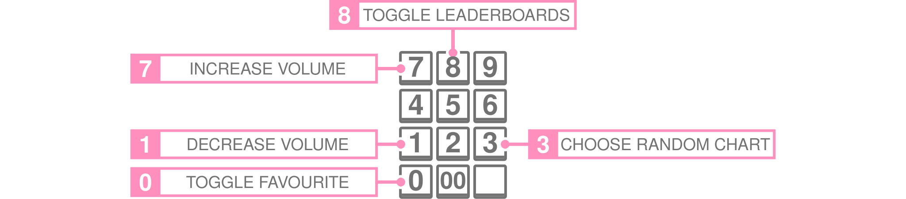
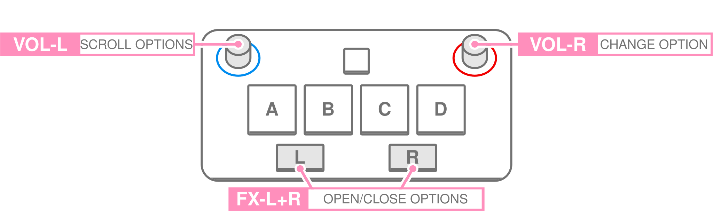
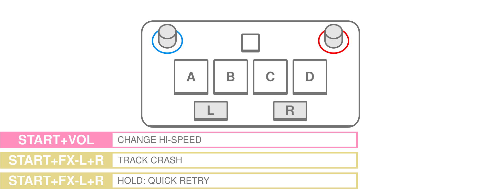

# Sound Voltex Controls
{:.no_toc}

The Sound Voltex games have a moderate list of controls and macros. The in-game tutorial should introduce the player to the basic gameplay controls of the game well enough. However, the game does not convey some of the other useful controls very well. Therefore, this page does not outline the basic gameplay controls, but instead catalogues a comprehensive list of controls which can be used to navigate through Sound Voltex, change settings, and activate certain features. 

This list was first written for the *SOUND VOLTEX VIVID WAVE* arcade games. Some features are locked behind the *Premium Time* mode, while others are accessable through standard play. This page was revisited in light of the recent release of *SOUND VOLTEX EXCEED GEAR コナステ* (Konaste) for the *E-Amusement Cloud* (EAC) home service. Most controls are similar, and thus this list has been updated to document both games. However, the Premium Time exclusive controls are enabled by default; it is as if the Premium Time mode is the default mode for this game. 

Hopefully this catalogue would be helpful to both new, and veteran players, who like to know about some slightly hidden features of the game.



### Table of Contents
{:.no_toc}

> - this unordered seed list will be replaced by toc as unordered list
> {:toc}

## Music Select

 

## Options

 

## Play

 

## Results

 

<button class="svgbutton" onclick="buttonFunc('divOld', 'buttonOlfOff', 'buttonOldOn')" style="margin: 28px 0 0 0;"></button>

**Glossary**

|Term|Abbreviation|Meaning|
|:-|:-|:-|
|Vivid Wave|VW||
|Exceed Gear|EG||
|コナステ|EAC|Konaste (cloud) version of the game.|
|Premium Time|[p]|10 minutes of safe gameplay with extra features (enabled in SDVX EG コナステ).|
|Hexa Diver|[h]|Mode where tracks can be unlocked by damaging bosses.|
|Numpad key|num-#|Button on the numpad. # could be a number.|
|Song wheel||The chart select screen.|
|Beats Per Minute|BPM|Measure of pulse for a piece of music.|
|xmod||Lane speed as kept as multiplier of the BPM.|
|mmod||Lane speed as kept as constant number.|
|Not Available|N.A.|Function not in the game.|

**Song Wheel**

|Function|Vivid Wave|Exceed Gear コナステ|Extra Description|
|:-|:-:|:-:|:-|
|Select option/folder/chart|Start|Start||
|Leave folder|FX-L|FX-L||
|Change Sort|FX-R|FX-R|EG has more options than VW.|
|Select chart|Knob-R|Knob-R||
|Fast scroll|FX-L + knob-R|FX-L + knob-R|Scrolls by catagories depending on sort.|
|Select difficulty|Knob-L|Knob-L|Change difficulty on the selected chart.|
|Toggle Rival leaderboards|num-8|N.A.||
|Toggle favourite chart|num-0|num-0||
|Random Chart|num-3|num-3|Chooses random chart from within the selected folder.|
|[p] Leave premium time|Hold BT-A, BT-B, BT-C, BT-D|N.A.|Yes/no prompt. Yes = end session.|
|[h] Leave Hexa Diver|FX-L|N.A.|Returns to songwheel.|

**Options Menu**

|Function|Vivid Wave|Exceed Gear コナステ|Extra Description|
|:-|:-:|:-:|:-|
|Toggle options menu|FX-L + FX-R|FX-L + FX-R|Toggle from songwheel.|
|Navigate options menu|FX-L, FX-R|Knob-L||
|Change option|Knob-#\*|Knob-R||
|Save mmod speed|N.A.|num-6|Changes red number when hovering over the Hi-speed options.|

\*According to what is shown in-game. 

**Waiting Lobby**

There is no waiting lobby when using Premium Time. These controls should also function during gameplay. Note that Exceed Gear コナステ uses mmod by default.

|Function|Vivid Wave|Exceed Gear コナステ|Description|
|:-|:-:|:-:|:-|
|Change xmod lane speed|Hold Start + knob|N.A.|Changes green multiplier with BPM.|
|Change mmod lane speed|Tap then hold start + knob|Hold Start + knob|Changes red number.|
|Force constant modspeed|Start + num-6|N.A.|Red number bottom left.|
|Visual offset|Start + num-9, num-3|Start + num-9, num-3|Blue number. + if early, - if late.|
|Audio offset w.r.t judgement|Start + num-8, num-2|Start + num-8, num-2|Yellow number. + if hitting early, - if hitting late.|
|Headphone volume|Start + num-7, num-1|N.A.|Bottom right gauge.|
|Skip lobby to play|FX-L + FX-R|N.A.||

**During Play**

|Function|Vivid Wave|Exceed Gear コナステ|Description|
|:-|:-:|:-:|:-|
|[p] Force track crash|FX-L + FX-R + start|FX-L + FX-R + start|Also works to skip tutorial.|
|[p] Force retry|Hold (FX-L + FX-R + start)|Hold (FX-L + FX-R + start)||
|[p] Auto retry|00|num-.||

**Result Screen**

|Function|Vivid Wave|Exceed Gear コナステ|Description|
|:-|:-:|:-:|:-|
|Show/hide detailed results|FX-L + FX-R|FX-L + FX-R||
|[p] Retry chart|Hold start|Hold Start||

