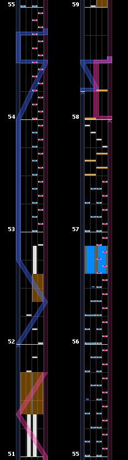

# Sound Voltex Strats
{:.no_toc}

Sound Voltex is a rather creative game in there being multiple ways to play certain patterns. Players can overcome difficult patterns with their own creative methods. On this page I document how I like to play certain patterns to hopefully simplify some of them for some players or help foster creativity.



## Table of Contents
{:.no_toc}

> - this unordered seed list will be replaced by toc as unordered list
> {:toc}

## The Strats

### Typhoon Craaash!! - Bar 53: Omega Trill - Amy Strat

*[The trill is just too exhausting.](https://mobiuslau.s-ul.eu/iT7wvBSs)*